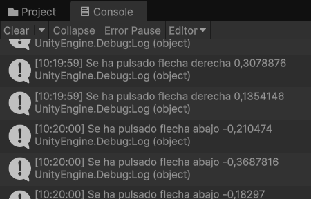
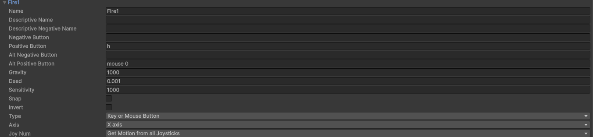
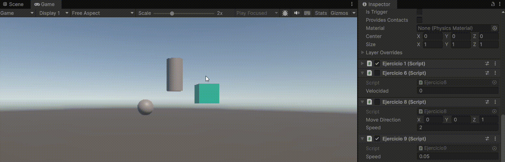
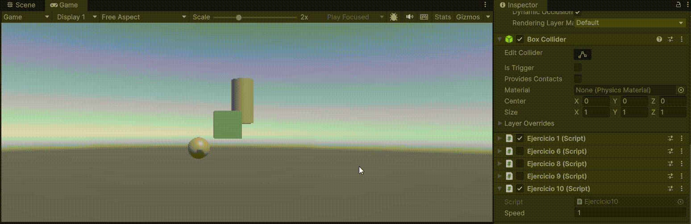
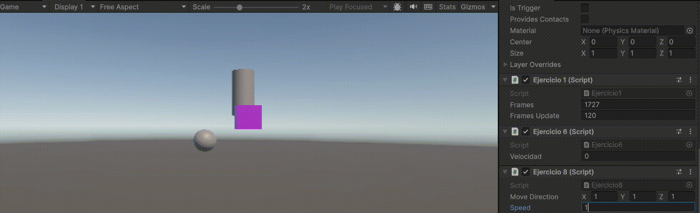
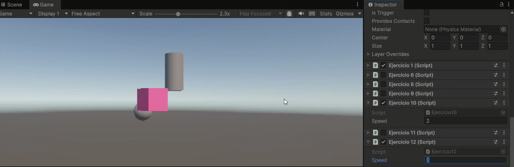
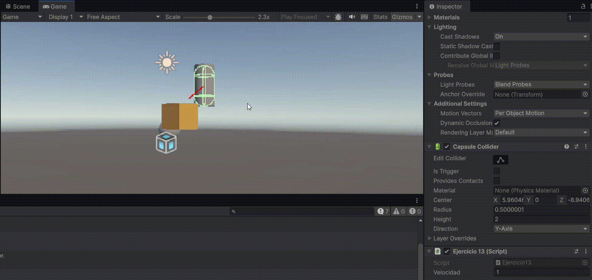

# Practica1-InterfacesInteligentes

## Ejercicio 1
Mediante las clases Color y Random logré hacer cambiar el color de un cubo de manera aleatoria cada ciertos frames. Mediante el inspector se puede modificar el número de frames necesarios para realizar el cambio de color.

## Ejercicio 2
Aquí vi diferentes propiedades y métodos de la clase Vector3

## Ejercicio 3
En este ejercicio accedí a la posición de un GameObject utilizando la propiedad transform y la imprimí en pantalla.

## Ejercicio 4
En este ejercicio pude acceder a dos GameObjects "ajenos" utilizando el método FindWithTag(), de este modo imprimí en pantalla la distancia entre el cubo y el cilindro de mi proyecto.

## Ejercicio 5
En este ejercicio añadí un objeto vacío y en su script añadí 3 vectores asociados a cada objeto de la escena, los cuales se pueden modificar desde el inspector y al pulsar la tecla de espacio los objetos se moverán en la dirección especificada.

## Ejercicio 6

## Ejercicio 7

## Ejercicio 8
De base, el cubo tendrá el vector (1, 1, 1) y velocidad 1)
a. El cubo se mueve el doble de rápido.
b. Ocurre lo mismo, el cubo se mueve el doble de rápido.
c. El cubo se mueve más lento.
d. El cubo se mueve en la misma dirección aunque las posiciones que obtiene son distintas en y.
e. El cubo seguirá teniendo el mismo comportamiento que de normal, a no ser que su rotación cambie con respecto al sistema de referencia mundial.

## Ejercicio 9

## Ejercicio 10

La velocidad es más manejable y no es necesaria reducirla mucho.

## Ejercicio 11

## Ejercicio 12

## Ejercicio 13

