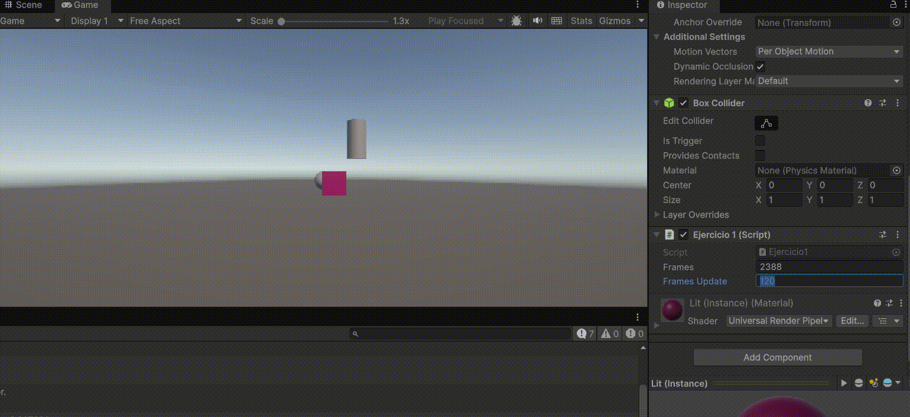
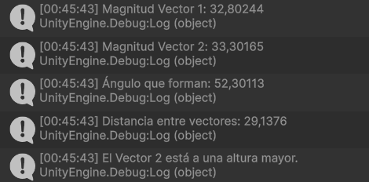

# Practica1-InterfacesInteligentes

## Ejercicio 1
Mediante las clases Color y Random logré hacer cambiar el color de un cubo de manera aleatoria cada ciertos frames. Mediante el inspector se puede modificar el número de frames necesarios para realizar el cambio de color.

## Ejercicio 2
Aquí vi diferentes propiedades y métodos de la clase Vector3

## Ejercicio 3
En este ejercicio accedí a la posición de un GameObject utilizando la propiedad transform y la imprimí en pantalla.

## Ejercicio 4
En este ejercicio pude acceder a dos GameObjects "ajenos" utilizando el método FindWithTag(), de este modo imprimí en pantalla la distancia entre el cubo y el cilindro de mi proyecto.

